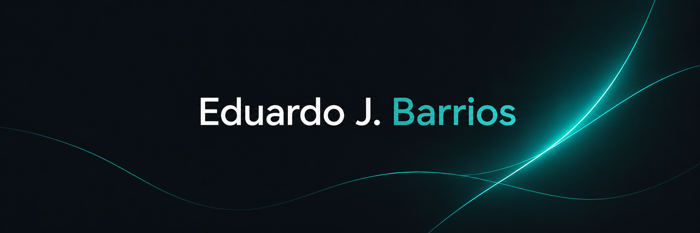

  

<h2 align="center">Software Engineer · MSc in Artificial Intelligence 🧠</h2>

  
  
  
  
  

  

---

## 📦 Python Packages

<h2>
  Actively working on
  <a href="https://github.com/edujbarrios/trainlens">TrainLens</a>
</h2>

  TrainLens turns AI training runs into research-grade notebook reports, directly inside Jupyter.

 

  
<b>More Python Packages</b>

 

| Package | Description | Downloads |
| :-- | :-- | :--: |
| [**embedding-drift-lite**](https://pypi.org/project/embedding-drift-lite/) | Lightweight utilities for detecting and inspecting embedding distribution drift. |  |
| [**metaclean-vlm**](https://pypi.org/project/metaclean-vlm/) | Metadata cleaning utilities for image and vision-language model workflows. |  |
| [**parametricbench**](https://pypi.org/project/parametricbench/) | Provider-independent benchmarks for catching LLM and VLM regressions across prompts, models, and generation settings. |  |
| [**promptshield-llm**](https://pypi.org/project/promptshield-llm/) | Simple checks for prompt injection, unsafe instructions, and LLM input risk. |  |
| [**rag-chunk-audit**](https://pypi.org/project/rag-chunk-audit/) | Tools for auditing RAG chunks, spotting weak segmentation, and improving retrieval quality. |  |
| [**text-to-music-prompt-structurer**](https://pypi.org/project/text-to-music-prompt-structurer/)  | Turn free-form musical ideas into structured prompts for text-to-music workflows. |  |
| [**visual-patch-audit**](https://pypi.org/project/visual-patch-audit/) | Utilities for auditing visual patches and inspecting image-level signals in VLM workflows. |  |
| [**vlm-occlusion**](https://pypi.org/project/vlm-occlusion/)  | Find which image regions influence a VLM claim through grid-based occlusion testing. |  |

---

## 🧠 AI Research

<h2>
  Check
  <a href="https://github.com/edujbarrios/maverick-oss">MAVERICK</a>,
  cognition-inspired AI research for multi-agent visual reasoning
</h2>

  Inspired by human visual cognition, MAVERICK decomposes image understanding into an auditable four-agent loop: perceive, describe, critique, and refine.

  Designed for interpretable VLM workflows, uncertainty-aware reasoning, and stronger model-ready image descriptions.

 

<h2>
  Explore
  <a href="https://neural-audio-theory.vercel.app/">Neural Audio Theory</a>,
  the engineering foundations behind AI music generation
</h2>

  An open educational project explaining how modern AI music systems work, from signal processing and embeddings to transformer and diffusion architectures, training, and prompt conditioning.

  Built for developers and researchers who want a technical understanding of the systems behind neural audio and music generation.

 

<h2>
  Discover
  <a href="https://github.com/edujbarrios/music-to-text">music-to-text</a>,
  local-first AI tooling for turning audio into structured metadata and music industry copy
</h2>

  An open-source Python framework that extracts acoustic features and generates A&R notes, PR pitches, playlist descriptions, and sync licensing blurbs, with or without an LLM.

  Built for reproducible audio analysis, structured exports, and OpenAI-compatible or fully local workflows.

---

## 🔦 RAG

<h2>
  Explore
  <a href="https://github.com/edujbarrios/lastlight">LastLight</a>,
  low-power RAG for offline disaster guidance
</h2>

  LastLight is a tiny local knowledge capsule that searches Markdown knowledge packs, returns sourced passages, and refuses to answer when retrieval confidence is too low.

  Built for constrained environments with no cloud API, embeddings, vector database, telemetry, package installation, browser, or background service.

---

## 🧩 UI Components

<h2>
  Check my
  <a href="https://edujbarrios-ui.vercel.app/">UI component library for AI</a>
</h2>

  edujbarrios-ui is a frontend component library for building clean AI interfaces, demos, and developer tools.

---

## 💻 Tech Stack

  
<b>Languages</b>

 

  
<b>AI Systems & Tooling</b>

 

---

## 📝 Latest Blog Posts

<!-- BLOG-POST-LIST:START -->
- [I Created a Complete Educational Guide on AI Music Generation](https://edujbarrios.com/blog/neural-audio-theory-complete-guide)
- [I Built My Own Documentation Site Builder - Here's Why and How](https://www.edujbarrios.com/blog/building-ncmds-documentation-site-builder)
- [I Built a Notebook Engine for C, and the Potential Is Incredible](https://edujbarrios.com/blog/c-notebook-engine-potential)
<!-- BLOG-POST-LIST:END -->

---

## 🎧 Beyond the Code

  
<b>Creative Side</b>

 

  <strong>Music Producer with 7+ years of experience and global reach.</strong>

  <a href="https://www.edujbarrios.com/music">
    🎵 Listen
  </a>

---

## 🖥 Environment

  
<b>OS & Development</b>

 

